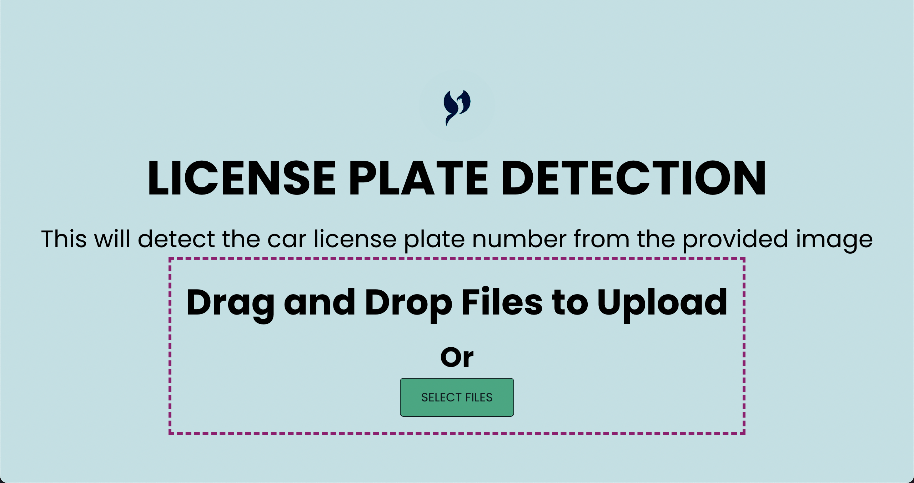
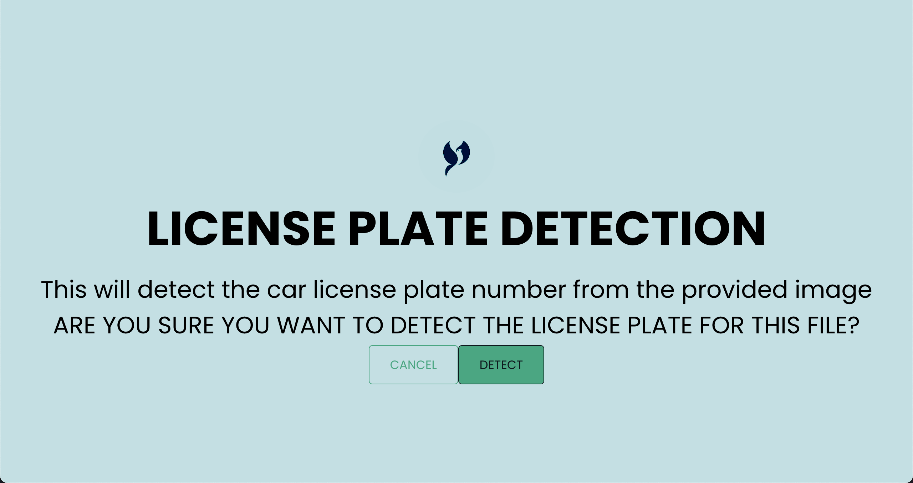
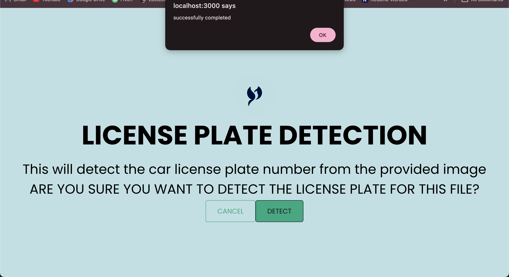
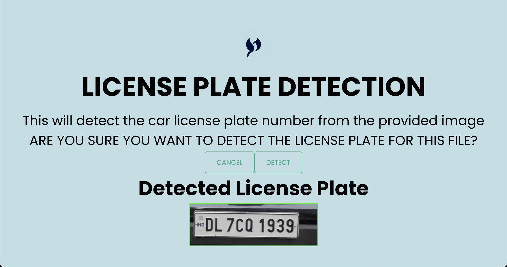

<h2 align="center">AUTOMATIC LICENSE PLATE RECOGNITION</h2>

<h4 align="center"> React.js | Flask | Python </h4>
 

> ALPR system is a basic machine learning project used to detect the license plate of a vehicle.
>  
> The goal of this project is to add more features and customization to the ALPR system. 

---

|               OUTPUT SCREENSHOTS                                    |
| ------------------------------------------------------------------- |

  
  <tab>
   

  

  
  <tab>
   

---

### Connect with me:

